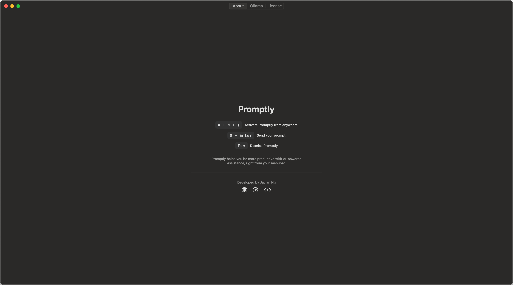
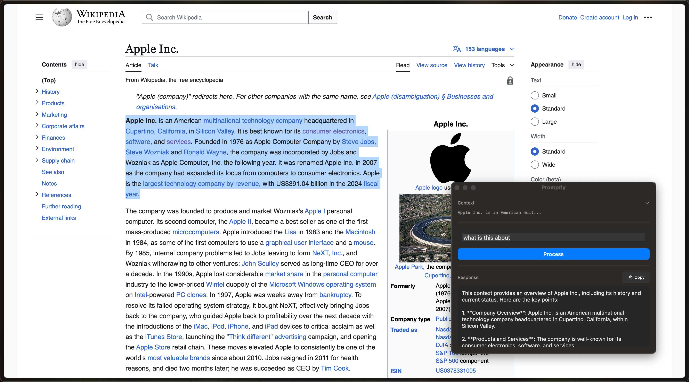
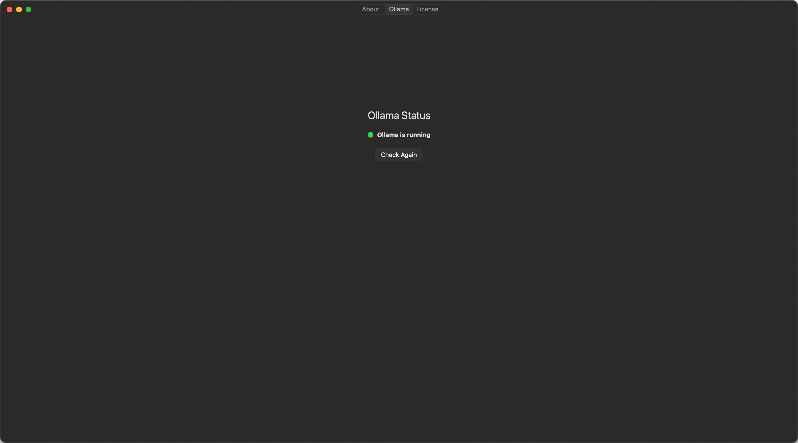
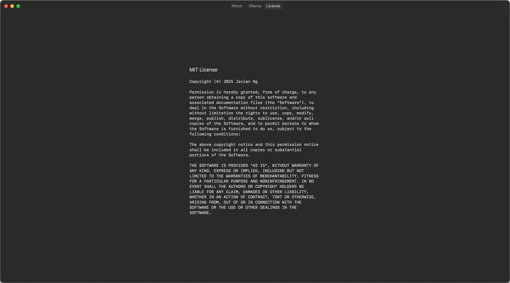
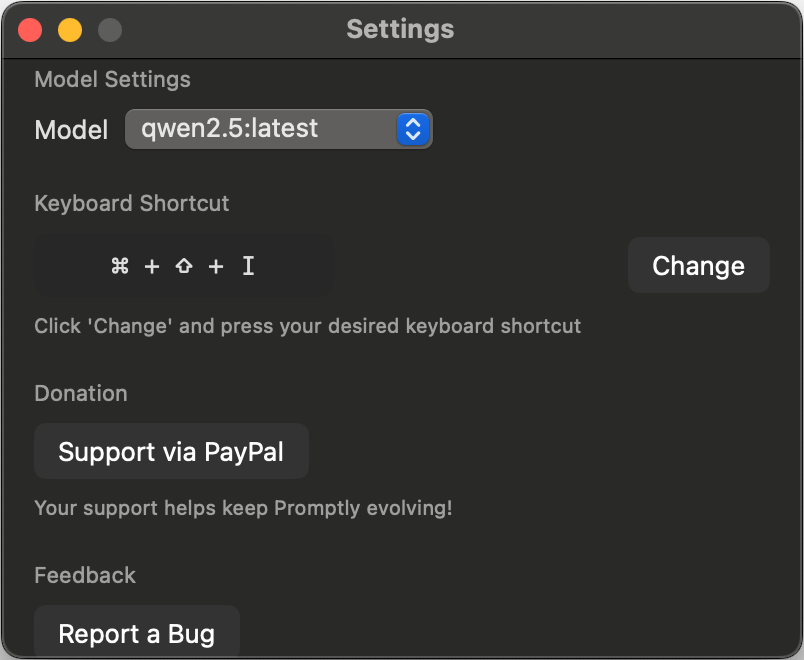

# Promptly


## A macOS AI Assistant in Your Menubar

Promptly is a lightweight macOS menubar application that gives you instant access to AI-powered assistance from anywhere in your system. Simply select text in any application, trigger Promptly with a keyboard shortcut, and get AI-generated responses based on the selected text.



## Features

- **Global Text Selection**: Select text in any application and instantly send it to Promptly
- **Customizable Keyboard Shortcuts**: Configure your preferred keyboard shortcut for quick access
- **Menubar Integration**: Stays out of your way until you need it
- **Ollama Integration**: Uses [Ollama](https://ollama.ai/) for local AI processing
- **Lightweight & Fast**: Minimal resource usage, instant response times
- **Beautiful Native UI**: Designed specifically for macOS

## Screenshots

### Prompt Box Interface


### Ollama Service Indicator Interface


### License Window


### Settings Panel


## Requirements

- macOS 13.0 or later
- [Ollama](https://ollama.ai/) installed and running locally for AI processing

## Installation

1. Download the latest release from the [Releases](https://github.com/javianng/Promptly/releases) page
2. Move Promptly.app to your Applications folder
3. Launch Promptly
4. Grant accessibility permissions when prompted (needed to capture text from other applications)

## How to Use

1. Select text in any application
2. Press ⌘⇧I (default shortcut) or your custom shortcut
3. Type your query about the selected text
4. Press Enter or click "Process"
5. Copy the response to your clipboard or read it directly in the Promptly window

## Configuration

### Keyboard Shortcuts

1. Click the Promptly icon in the menubar
2. Select "Settings"
3. Click "Change" next to the keyboard shortcut
4. Press your desired key combination
5. Click "Done" to save

### AI Model

1. Click the Promptly icon in the menubar
2. Select "Settings"
3. Choose your preferred Ollama model from the dropdown

## Building from Source

Promptly is built with Swift and SwiftUI.

1. Clone the repository
2. Open the project in Xcode
3. Build the application (requires macOS 13.0+ and Xcode 14.0+)

```bash
git clone https://github.com/javianng/Promptly.git
cd Promptly
swift build
```

## License

MIT License - See [LICENSE](LICENSE) for more information.

## About the Developer

Developed by [Javian Ng](https://www.javianng.com). Connect on [LinkedIn](https://www.linkedin.com/in/javianngzh/) or check out more projects on [GitHub](https://github.com/javianng).